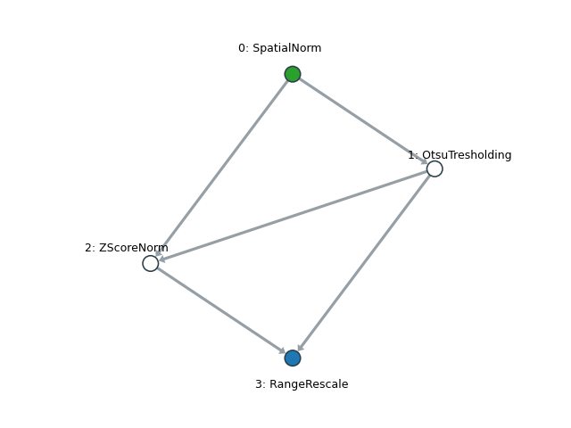

# Introduction

Radiomics is the high-throughput data mining of imaging features to identify potential markers that are relevant to a
pathology or an interesting trait. It has the potential to enable personalized treatment design and disease management.
To be able to characterize a lesion in a non-invasive fashion is its major value. However, the clical community is expressing concerns with regard to the reproducibility of radiomics results. 

Reproducibility is unfortunately a complicated issue for radiomics because it invovles multiple steps and each step 
contributes some variations that could stack up along the pipeline and lead to unstable results. Its some what like 
trying to walk straight blind-folded such that the error you make each stack accumulates and you will probably find 
yourself way off when you take the cloth off.

One of the most important source of this variation comes from image acquisition, particularly weighted MRI. Majority of
the clinically evaluated MRI sequences are not quantitative such that the pixel intensities are not tissue-specific, 
including the commonly used T1- and T2-weigthed sequences. This means that the same patients scanned in different 
machine, or even the same machine at different time, could give images with very different intensity profiles. As such, many normalization algorithms were proposed to enable quantitative studies using MRI. 

Regardless, normalization algorithms are a crucial factors that affects the values of the radiomics features extracted. 
In other words, same image normalized differently gives different radiomics features and does not yeild valid 
comparison. With this regards, this code repo aims to provide a user-friendly and standardized way to normalize the 
images

# Requirements

- SimpleITK >= 2.1.0
- networkx >= 2.5
- decorator >= 5.0.7
- cachetools >=4.2.2

# Examples 

>
>
>Caption: {0: 'SpatialNorm', 1: 'OtsuTresholding', 2: 'ZScoreNorm', 3: 'RangeRescale'}
```python
from mnts.filters.geom import *
from mnts.filters.intensity import *
from mnts.filters.mnts_filters import MNTSFilterGraph
import networkx as nx
import matplotlib.pyplot as plt
import SimpleITK as sitk

# Create the normalization graph.
G = MNTSFilterGraph()

# Add filter nodes to the graph.
G.add_node(SpatialNorm(out_spacing=[1, 1, 0]))
G.add_node(OtsuTresholding(), 0)    # Use mask to better match teh histograms
G.add_node(ZScoreNorm(), [0, 1])
G.add_node(RangeRescale(0, 5000), [2,1], is_exit=True) # Label this as the output node

# Plot and show the graph
G.plot_graph()
plt.show()

# Load image
eg_input = Path(r"./example_data/MRI_01.nii.gz")
if not eg_input.is_file():
raise IOError("Error opening example data.")
im = sitk.ReadImage(eg_input.resolve().__str__())
orig_dtype = im.GetPixelID()

# Execute the graph
im = G.execute(im)

# Cast the image back into its original datatype
im = sitk.Cast(im, orig_dtype)

# Save the image
eg_output = Path(r"./example_data/output/EG_03.nii.gz")
eg_output.parent.mkdir(parents=True, exist_ok=True)
sitk.WriteImage(im, eg_output.resolve().__str__())
```